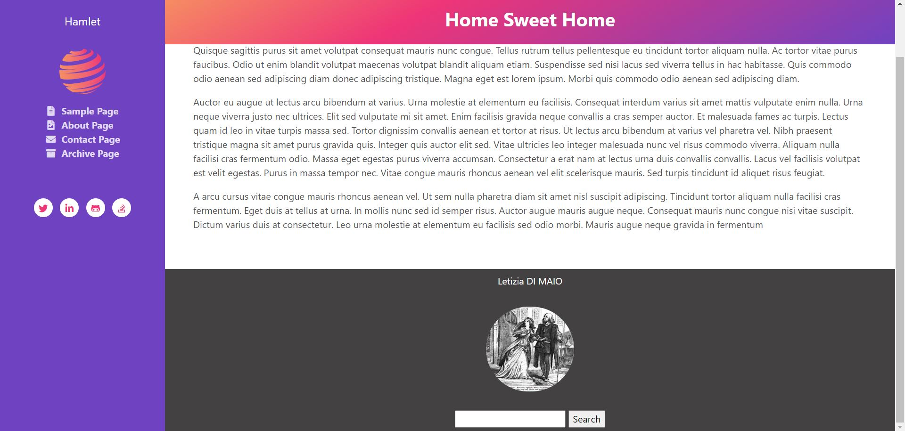
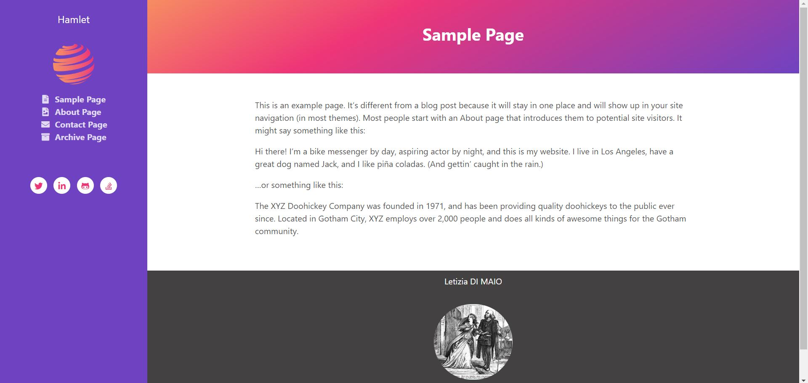
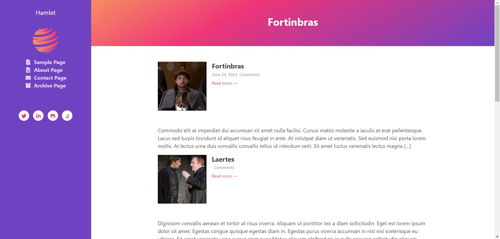
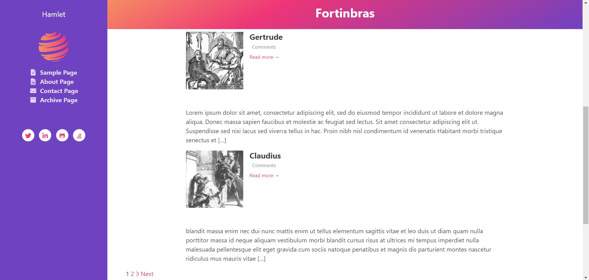
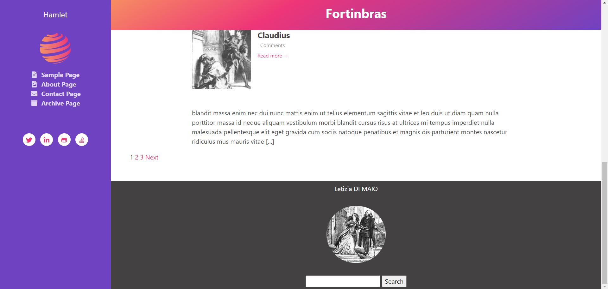
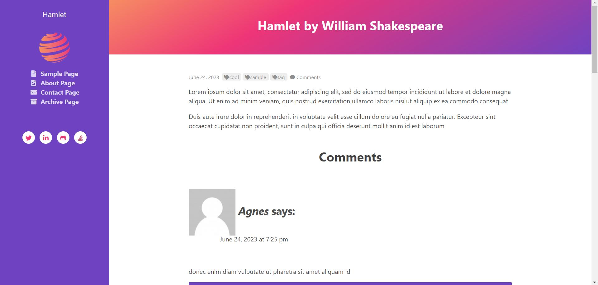
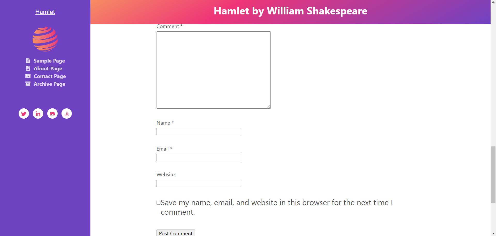
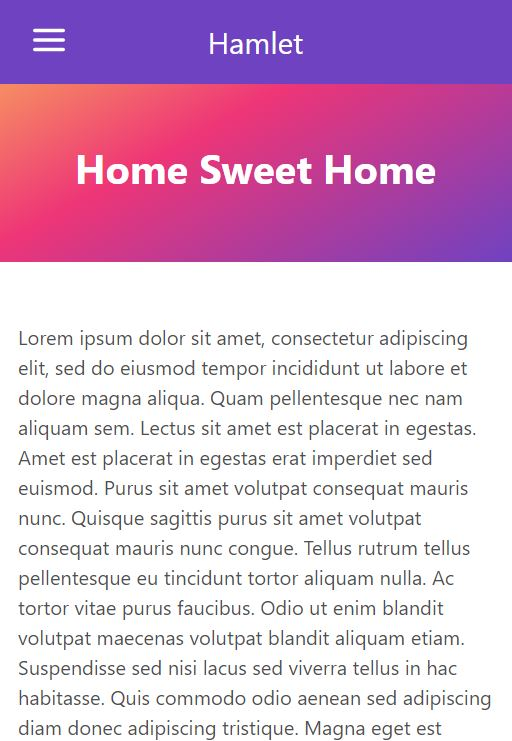
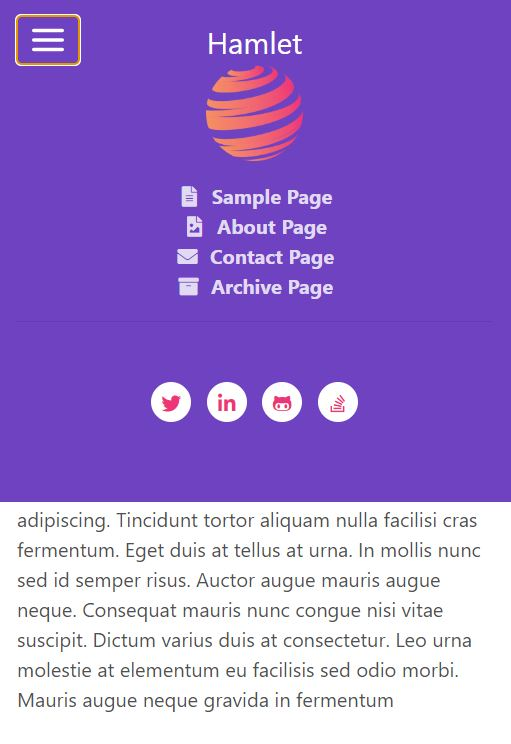
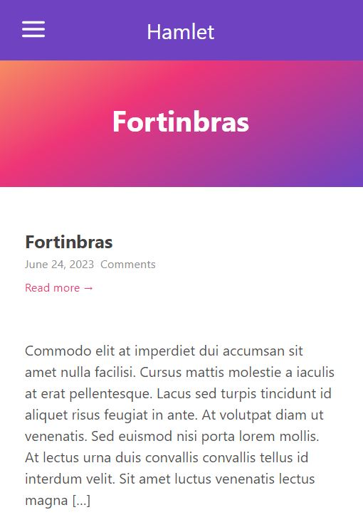

# Hamlet 🎭

## A WordPress theme converted from an HTML ➕ CSS template 🎀 

| WordPress version | Web server version | PHP version | Database version |
| ---               | ---                | ---         | ---              |
| 6.2.2             | nginx 1.16.0       | 8.1.9       | MySQL 8.0.16     |

## Tools I used to build "Hamlet" 🧰

- [LocalWP](https://localwp.com/)
- WordPress
- PHP
- HTML
- CSS
- JavaScript

## Mockups on Desktop (1920 x 917 px) 💻

## Mockups on Mobile (412 x 915 px) 📱

&nbsp;

📓 Documentation [^1]
[^1]: https://developer.wordpress.org/

